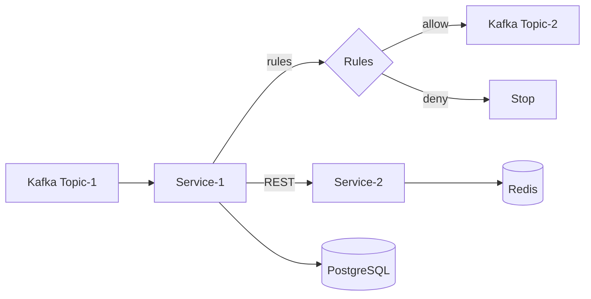

# Moderation System

Проект 2: Модерация обращений клиентов (event-driven)

## Состав
- Service-1: слушает Kafka Topic-1, вызывает Service-2, применяет правила, публикует в Topic-2
- Service-2: REST сервис, берёт данные из Redis
- PostgreSQL: хранение идемпотентности и активных обращений
- Kafka: Topic-1 и Topic-2
- Redis: кэш расширенной информации

## Диаграмма


## Запуск
Из корня проекта:

- `docker compose up --build`

Порты:
- Service-1: 8081
- Service-2: 8082
- Kafka: 9092
- Redis: 6379
- PostgreSQL: 5433

## Правила модерации
1) Если событие уже обработано (eventId есть в БД) — выход
2) Если у клиента уже есть активное обращение по той же категории — выход
3) Если категория входит в `rules.restricted-categories` и сейчас вне рабочего времени — выход
4) Если все правила пройдены — отправка результата в Topic-2

## Service-2 (Redis)
Ключ: `enrichment:{clientId}:{category}`
Поля: `customerType`, `riskLevel`

При отсутствии данных возвращается `found=false`.

## Пример события (Topic-1)
```json
{
  "eventId": "evt-1",
  "clientId": "client-1",
  "category": "fraud",
  "createdAt": "2026-02-01T10:00:00+06:00"
}
```

## Проверка
Отправь сообщение в Topic-1 (например, через kafka-console-producer) и проверь, что Service-1 публикует результат в Topic-2.

## Как тестировать реализацию

### 1) Подготовка топиков
```bash
docker exec -i moderation-kafka /opt/kafka/bin/kafka-topics.sh --bootstrap-server localhost:9092 --list
docker exec -i moderation-kafka /opt/kafka/bin/kafka-topics.sh --bootstrap-server localhost:9092 --create --topic topic-1 --partitions 1 --replication-factor 1
docker exec -i moderation-kafka /opt/kafka/bin/kafka-topics.sh --bootstrap-server localhost:9092 --create --topic topic-2 --partitions 1 --replication-factor 1
```

### 2) Запуск слушателя Topic-2
```bash
docker exec -i moderation-kafka /opt/kafka/bin/kafka-console-consumer.sh --bootstrap-server localhost:9092 --topic topic-2 --from-beginning
```

### 3) Отправка события в Topic-1
```bash
docker exec -i moderation-kafka /opt/kafka/bin/kafka-console-producer.sh --bootstrap-server localhost:9092 --topic topic-1
```
Пример сообщения:
```json
{"eventId":"evt-100","clientId":"client-1","category":"general","createdAt":"2026-02-01T10:00:00+06:00"}
```

### 4) Проверка кейсов
**Идемпотентность**: отправь событие с тем же `eventId` повторно — новое сообщение в Topic-2 не появится.

**Активное обращение**: отправь событие с новым `eventId`, но тем же `clientId` и `category` — публикации не будет.

**Рабочее время**: категории из `restricted-categories` (например, `fraud`, `chargeback`) вне рабочего времени не публикуются.

## Тест производительности (100 rps)
```bash
docker exec -i moderation-kafka /opt/kafka/bin/kafka-producer-perf-test.sh \
  --topic topic-1 \
  --num-records 1000 \
  --record-size 200 \
  --throughput 100 \
  --producer-props bootstrap.servers=localhost:9092
```
